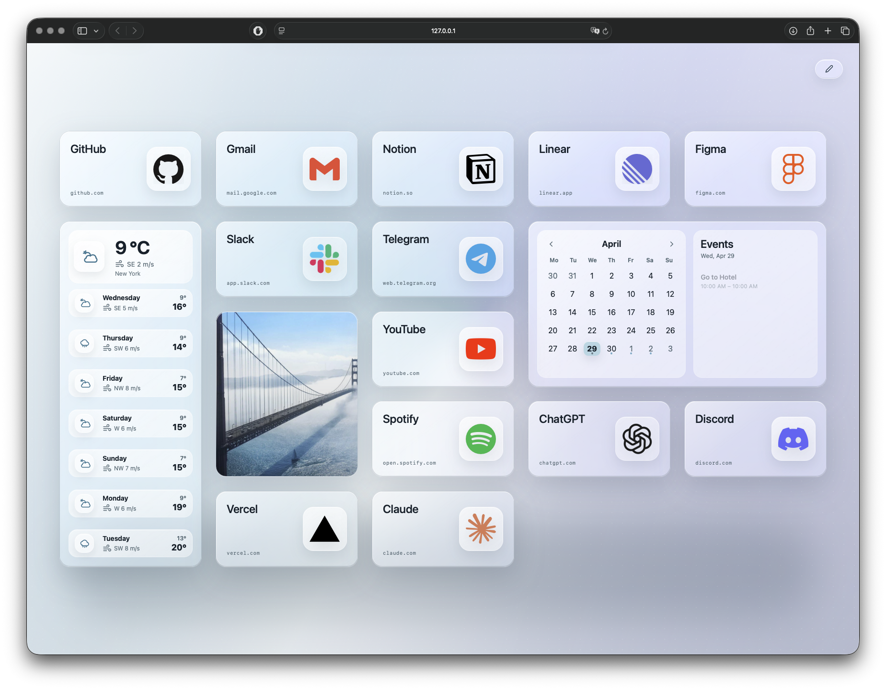
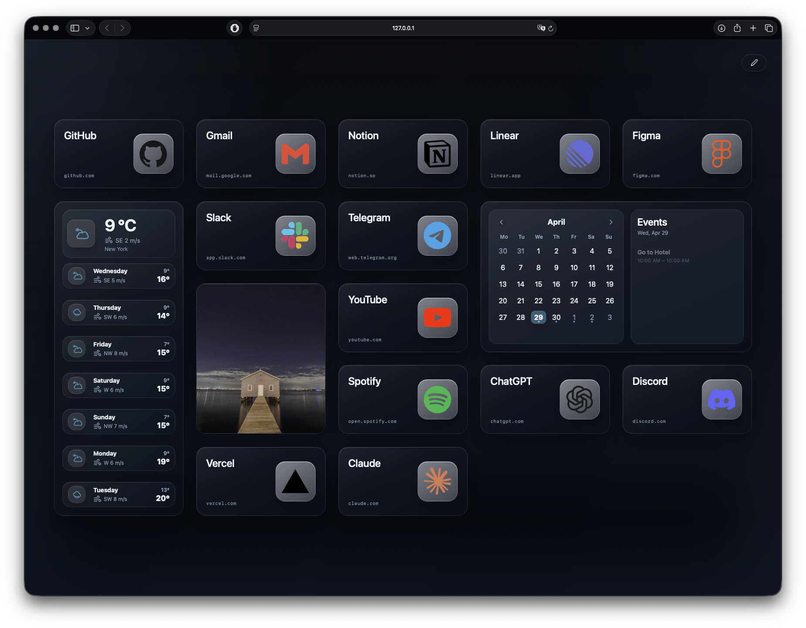
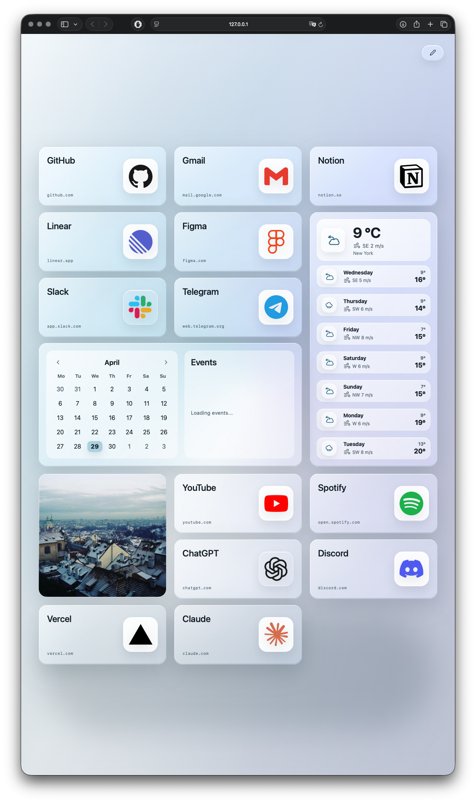
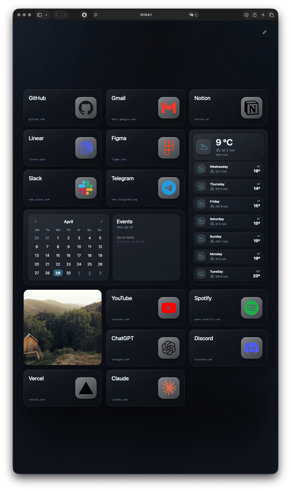

# Launchly

Safari's start page isn't customizable — you get what Apple gives you. Launchly replaces it with a dashboard you control: your bookmarks, weather, calendar, and a live image, served from your own Mac with no accounts or subscriptions.

| | |
|---|---|
|  |  |
|  |  |

## Features

- **Bookmark tiles** — one-click links to your most-used apps, laid out the way you want
- **Weather** — current conditions + 7-day forecast via [Open-Meteo](https://open-meteo.com/) (no API key needed)
- **Calendar** — reads from Apple Calendar directly; picks up every synced calendar (iCloud, Exchange, local)
- **Image tile** — rotating photo from any direct-link URL, or a random placeholder
- **Themes** — several built-in themes plus a live theme editor
- **macOS LaunchAgent** — optional, keeps the backend running on login

## Quick Start

```bash
git clone git@github.com:bunyodrafikov/launchly.git
cd launchly
npm install
npm run dev        # frontend at http://localhost:5173
npm run server     # backend at http://localhost:4317
```

Open **http://localhost:5173** — the dashboard appears immediately with example content.

## Customise Your Tiles

Example tiles and settings live in `config/*.example.ts`. Copy them to create your personal config (gitignored):

```bash
cp config/tiles.example.ts config/tiles.ts
cp config/settings.example.ts config/settings.ts
```

Edit `config/tiles.ts` for your bookmarks and `config/settings.ts` for your name, weather location, and default search engine. Vite picks them up automatically — no import changes needed.

Available settings in `config/settings.ts`:

| Field | Default | Purpose |
|---|---|---|
| `name` | `"Friend"` | Your name (shown in greeting if you add one) |
| `defaultSearchEngine` | `"google"` | Initial search engine: `google`, `duckduckgo`, `perplexity`, `chatgpt` |
| `weatherSettings.label` | — | Location name shown in the weather tile |
| `weatherSettings.latitude` / `longitude` | — | Coordinates for weather data |
| `weatherSettings.units` | `"metric"` | `"metric"` or `"imperial"` |

### Tile structure

```ts
{
  id: "github",
  kind: "bookmark",
  title: "GitHub",
  subtitle: "github.com",
  href: "https://github.com",
  icon: "https://cdn.simpleicons.org/github/181717",  // CDN or local path
  layout: { horizontal: "wide", vertical: "wide" }
}
```

Icons can be any direct-link URL or a file placed in `config/icons/` (referenced as `/assets/icons/filename`). [Simple Icons CDN](https://simpleicons.org/) covers most services. Layout size options: `wide`, `small`, `forecast`, `calendar`, `image`.

## Server Config (optional)

Copy `config/server.example.js` to `config/server.js` and fill in what you need. Everything is optional.

```bash
cp config/server.example.js config/server.js
```

| Field | Purpose |
|---|---|
| `port` | Server port (default `4317`) |
| `googleWeatherApiKey` | Higher-accuracy weather; falls back to Open-Meteo without it |
| `imageFeedUrl` | Direct-link image URL for the rotating tile |

## Calendar Setup (macOS)

The calendar tile reads from **Apple Calendar** — no API keys, no OAuth. All calendars already synced on your Mac appear automatically.

Start the backend (`npm run server`) and open the dashboard. macOS will show a one-time permission prompt. Click **Allow**.

If you missed the prompt: **System Settings → Privacy & Security → Calendars** → enable access for Terminal or Node.

## Set as Safari Start Page

1. Run the backend: `npm run server` (or install the LaunchAgent below so it starts automatically)
2. In Safari: **Settings → General**
   - Set **New windows open with** → Homepage
   - Set **New tabs open with** → Homepage
   - Set **Homepage** to `http://localhost:4317`

## Auto-Start on Login (macOS)

Install a per-user LaunchAgent so the backend starts automatically:

```bash
chmod +x scripts/install-launch-agent.sh scripts/uninstall-launch-agent.sh
scripts/install-launch-agent.sh
```

Then set your browser's start page to `http://localhost:4317`.

To uninstall:

```bash
scripts/uninstall-launch-agent.sh
```

Logs are written to `~/Library/Logs/startup-dashboard/`.

## Development

```bash
npm run dev      # Vite dev server with hot reload
npm run server   # Node backend
npm run build    # Production build to dist/
npm run test     # Tests
npm run lint     # TypeScript type check
```

## Stack

- **Frontend**: Vite + TypeScript, hand-authored CSS
- **Backend**: Node.js HTTP server (no framework)
- **Calendar**: Apple Calendar via JXA (macOS only)
- **Weather**: Open-Meteo (free, no key) or Google Weather API
- **Tests**: Node built-in test runner
